<h1 align="center">Hi 👋, I'm Sumit Kumar</h1>

  <b>Pre-final Year CSE Student · DSA & Frontend Focused</b> 
  <b>React · JavaScript · C++</b>

  
  
  

---

<table>
<tr>
<td width="60%" valign="top">

### 👨‍💻 About Me
- 🎓 Computer Science Undergraduate (Pre-final year)
- 💻 Strong in **DSA (C++)** and **Frontend (React)**
- 🚀 Building real projects, not tutorials
- 🎯 Targeting **SDE / Frontend Internships**
- ☕ Fun fact: I drink more chai than water

---

### 🧠 Tech Stack (What I Actually Use)

**Languages**
- C++
- JavaScript

**Frontend**
- React
- HTML
- CSS
- Tailwind

**Backend (Basic)**
- Node.js

**Tools**
- Git
- GitHub
- VS Code

---

### 🚀 Featured Projects

| Project | Tech | Highlights |
|-------|------|------------|
| **Portfolio Website** | React, Tailwind | Clean UI · Responsive · Deployed |
| **DSA Practice Repo** | C++ | Topic-wise solutions |
| **Mini Web Apps** | JS, React | API usage · State mgmt |

</td>

<td width="40%" align="center">

</td>
</tr>
</table>

---

## 📊 GitHub Activity & Stats

  

---

## 🔗 Connect With Me

  
  
  

---

  <i>Clean code · Consistent effort · Real projects</i>

